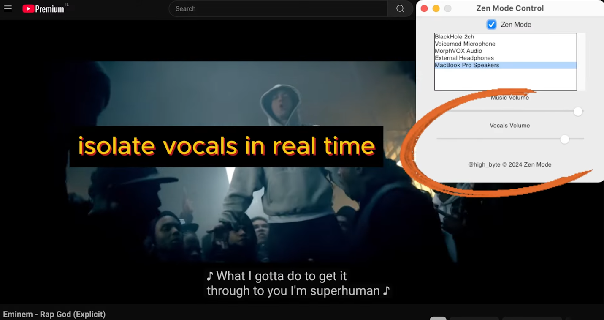

[](https://www.youtube.com/watch?v=HqHCqQX3_Vo)


# How It Works

The original audio playback needs to be recorded, processed with AI and finally replaced with AI-processed audio.

Normally an audio device is either an input (microphone) or an output device (speakers), so a virtual audio device is needed that is both an input and an output device.

The virtual audio devices are installed via VB-Cable on Windows and BlackHole on MacOS.

Once a virtual audio device is installed, it needs to be set as the default output device, and it is used as an input device for the program.

The processed audio is sent to the physical output device directly.

Note this makes it possible to change specific applications audio output in the system mixer settings - using the virtual device for AI processing or the physical device to bypass the program.

# Setup

create environment based on target execution provider: cuda, directml, mps

on Windows use either one of:
```sh
# cuda:
set provider=cuda

# directml:
set provider=directml
```

and then:

```sh
conda create -y -n dbz-%provider% python=3.10.15
conda activate dbz-%provider%
pip install -r requirements-%provider%.txt
```

# Building

### Windows

```sh
# ensure pyinstaller is installed; on windows it's available from pip
pip install pyinstaller==6.11.0

# build executable binary:
pyinstaller zen_mode.py -y --name=zen_mode-%provider% --icon=img/zen-256.ico --windowed --onefile
pyinstaller zen_mode.spec -y
```

NOTE: for some reason the directml version does not include the import, even when using `--hidden-import` and/or `--collect-submodules`.

it is possible to fix manually if not using --onefile and simply copying the package directory from `Lib/site-packages/torch_directml` into `dist/_internal`

in any case, the `bin`, `img` and `models` directories need to be copied to the same directory as the binary executable, so might as well also copy `torch_directml`.

### Mac

```sh
# on macos `pyinstaller` needs to be installed from `conda-forge`:
conda install -c conda-forge pyinstaller==6.11.0

# build executable binary:
pyinstaller zen_mode.py -y --exclude-module pkg_resources --icon=img/zen-256.ico --windowed --onefile
pyinstaller zen_mode.spec -y
```

### Post-build

TODO: need to create a bundling script.
meanwhile just do it manually by copying these directories to the same as the binary executable:

```sh
cp -r img dist/.
cp -r models dist/.

# on windows also copy:
cp -r bin dist/.
```

## TODO:

- ~~copy volume levels when changed~~
- monitor audio devices plugged/unplugged
- ~~reduce build size~~ (cuda -> directml. fast enough and 10x smaller when zipped)
- add a tray icon
- ~~add splash~~ (pyinstaller splash is buggy, skipped)
- ~~ui~~
- keyboard shortcuts
- plausible analytics: https://plausible.io/docs/events-api

# Internals

Some functionalities such as volume control are very poorly supported, no official API.

A lot can be done with `pycaw` on Windows and `osascript` on MacOS, but also rely on external utilities such as `SoundVolumeView.exe` on Windows and `SwitchAudioSource` on MacOS.

## Windows

### Virtual Audio Drivers

One-click install by `bin/VBCABLE_Setup_x64.exe`.
(only Windows 10 driver is included which supports Windows 11 too)

### Audio Device Control

`SoundVolumeView.exe` (by same developer as `NirCmd.exe`, unfortunately neither open source but incredibly useful)

it is mainly used to get devices uuid, get and set the default device and control volume.
pyaudio only gives the name; TODO: perhaps pycaw + maybe custom COM script I have may replace this.

```bat
rem get list of devices
SoundVolumeView.exe /scomma list.csv /Columns "Name,Command-Line Friendly ID"

rem set default output device by name / uuid
SoundVolumeView.exe /SetDefault "VB-Cable Input" all
SoundVolumeView.exe /SetDefault Speakers all
SoundVolumeView.exe /SetDefault Headphones all

rem set volume
SoundVolumeView.exe /SetMute "VB-Cable Input" 0
SoundVolumeView.exe /SetVolume "VB-Cable Input" 100

rem no get volume, using pycaw instead
rem (see get_system_volume in device_manager_windows.py)
```

## MacOS

### Virtual Audio Drivers

to record audio output, need to:
```sh
# (sudo?)
brew install blackhole-2ch
brew install portaudio
```

if having issues with pyaudio / portaudio (especially when using `zen_from_file.py`) may need to rebuild from source and/or link:
```sh
brew link portaudio
pip install pyaudio
# (best practice is to pin to the same version in requirements.txt)
```

notice I needed to go to `Settings -> Privacy & Security -> Microphone` and add "cursor" (yes the IDE wtf?) to the allowed apps list.
(need to figure out how to allow python/my specific program)

### Audio Device Control

install `SwitchAudioSource` via homebrew:
```sh
brew install switchaudio-osx
```

example commands:
```sh
# list audio devices
SwitchAudioSource -a

# set default output device
SwitchAudioSource -s "BlackHole 2ch"
SwitchAudioSource -s "MacBook Pro Speakers"
```

ensure the recording device volume is sufficient:
```sh
SwitchAudioSource -s "MacBook Pro Speakers"
osascript -e "set volume output volume 100 --100%"
SwitchAudioSource -s "BlackHole 2ch"
osascript -e "set volume input volume 100 --100%"
```

for `zen_from_file.py` to run in mac `libsndfile` needs to be installed like so:
```sh
conda install -c conda-forge libsndfile
```
